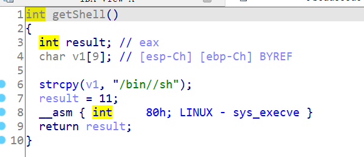

# 知识点

签到

# 题目分析

1. 查看保护情况，32位程序，开启NX和PIE保护。

       Arch:     i386-32-little
       RELRO:    Partial RELRO
       Stack:    No canary found
       NX:       NX enabled
       PIE:      PIE enabled

2. 拖入IDA分析，发现直接进行了系统调用，eax存放调用号11，参数/bin/sh入栈。

   

# EXP

直接运行即可得到shell。