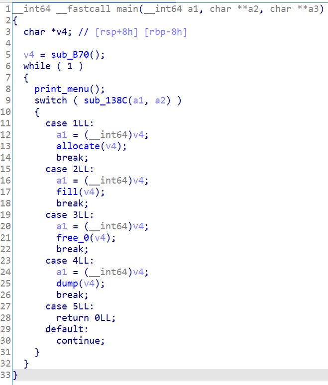
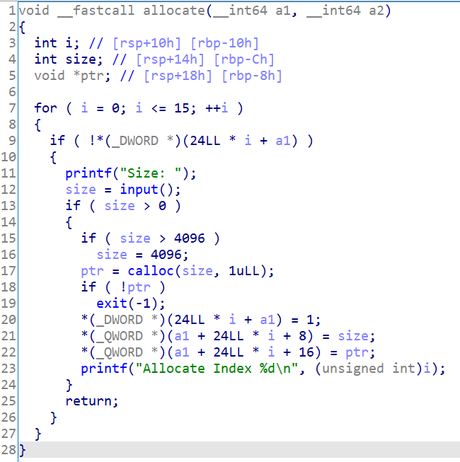
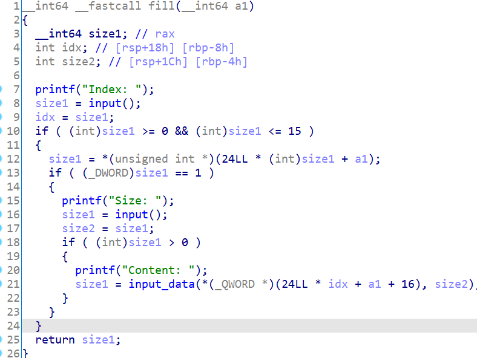
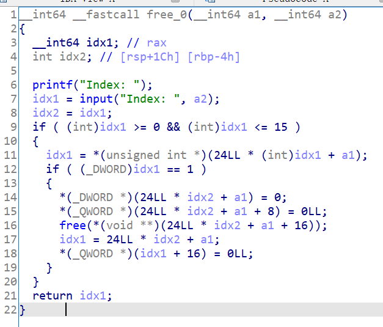
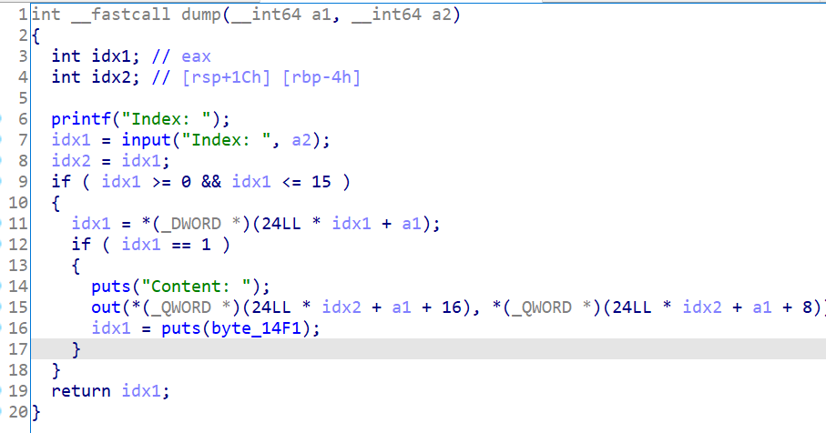

# 知识点

堆溢出、Unlink

# 题目分析

1. 检查保护情况。64位程序，保护全开。

       Arch:     amd64-64-little
       RELRO:    Full RELRO
       Stack:    Canary found
       NX:       NX enabled
       PIE:      PIE enabled

2. 拖入IDA分析，程序存在allocate、fill、free、dump四个功能。

   

3. 分析allocate函数，共可存放16个chunk，a1是heap的基地址。

   结构体如下：

   ```c++
   struct {
       int inuse;
       long size;
       Data* data;
   }
   ```

   

4. 分析fill函数，发现没有限制填充数据的大小，可以任意输入大小。因此存在堆溢出漏洞。

   

5. 分析free函数，正常free，并将指针置0。没有漏洞。

   

6. 分析dump函数。根据结构体中保存的长度输出数据的内容。

   
   
7. 通过堆溢出，我们可以修改next_chunk的prev_size和size域，因此可以使用Unlink利用漏洞。

# EXP

